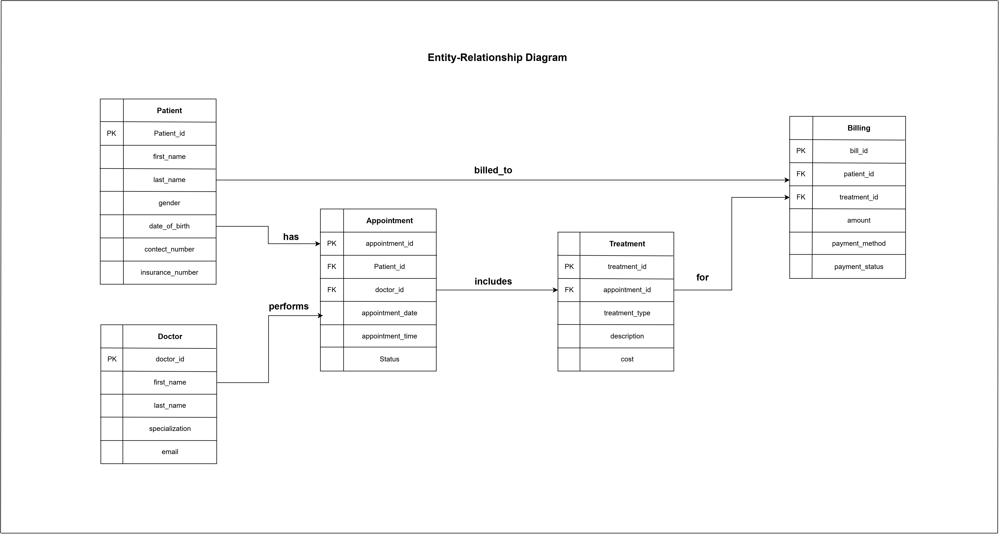

::: {align="center"}
# 🏥 Hospital Management Data Analysis

### SQL • MySQL • Power BI • Excel • Data Analytics

```{=html}
<p>
```
`<strong>`{=html}A complete hospital data analysis project designed to
transform operational healthcare data into actionable business
insights.`</strong>`{=html}
```{=html}
</p>
```
```{=html}
<p>
```
``{=html}
``{=html}
``{=html}
``{=html}
``{=html}
```{=html}
</p>
```
```{=html}
<p>
```
``{=html}
``{=html}
``{=html}
``{=html}
``{=html}
```{=html}
</p>
```
:::

------------------------------------------------------------------------

## 📌 Table of Contents

-   [📖 Project Overview](#-project-overview)
-   [🎯 Purpose](#-purpose)
-   [🏢 Business Problem](#-business-problem)
-   [💡 Project Objectives](#-project-objectives)
-   [📊 Dataset Overview](#-dataset-overview)
-   [🗂️ Database Structure](#️-database-structure)
-   [🔗 Entity Relationships](#-entity-relationships)
-   [🧰 Technology Stack](#-technology-stack)
-   [📁 Project Structure](#-project-structure)
-   [🔄 Project Workflow](#-project-workflow)
-   [🧮 SQL Analysis](#-sql-analysis)
-   [📈 Power BI Dashboard](#-power-bi-dashboard)
-   [📌 Key Findings](#-key-findings)
-   [🧪 Data Quality & Validation](#-data-quality--validation)
-   [▶️ How to Run the Project](#️-how-to-run-the-project)
-   [🖼️ Project Documentation](#️-project-documentation)
-   [📋 Skills Demonstrated](#-skills-demonstrated)
-   [🚀 Future Implementation](#-future-implementation)
-   [🛠️ Recommended Improvements](#️-recommended-improvements)
-   [📚 Learning Outcomes](#-learning-outcomes)
-   [🤝 Contribution](#-contribution)
-   [📄 License](#-license)
-   [👤 Author](#-author)

------------------------------------------------------------------------

## 📖 Project Overview

**Hospital Management Data Analysis** is a data analytics project that
analyzes hospital operations across patients, doctors, appointments,
treatments, and billing.

The project follows an end-to-end analytics workflow:

``` text
Raw Hospital Data
       ↓
Data Cleaning & Validation
       ↓
Relational Database Design
       ↓
MySQL / SQL Analysis
       ↓
Business Questions & KPIs
       ↓
Power BI Data Modeling
       ↓
Interactive Dashboard
       ↓
Business Insights & Recommendations
```

The main objective is not to build a hospital management application.
Instead, the project focuses on **using structured hospital data to
understand operational performance, treatment activity, appointment
patterns, billing behavior, and revenue trends**.

------------------------------------------------------------------------

## 🎯 Purpose

The project was created to demonstrate how a data analyst can convert
raw healthcare operational data into a structured analytical solution.

### The project focuses on:

-   👨‍⚕️ Doctor workload and appointment distribution
-   🧑‍🤝‍🧑 Patient activity and treatment history
-   📅 Appointment status and visit reasons
-   💊 Treatment types and treatment costs
-   💰 Billing and payment performance
-   📊 Revenue analysis
-   📈 KPI development
-   🔎 SQL-based business analysis
-   📉 Power BI visualization and reporting

------------------------------------------------------------------------

## 🏢 Business Problem

Hospitals generate large amounts of operational data every day. Without
structured analysis, it can be difficult to answer questions such as:

> Which doctors handle the highest number of appointments?

> What is the most common reason for a hospital visit?

> Which treatment types have the highest average cost?

> How much revenue has been generated?

> Which patients contribute the highest lifetime billing value?

> What percentage of appointments are completed, cancelled, scheduled,
> or marked as no-show?

> Which payment methods contribute the most revenue?

A hospital management team can use answers to these questions to
improve:

-   Resource allocation
-   Appointment planning
-   Treatment monitoring
-   Financial performance
-   Patient service
-   Operational decision-making

------------------------------------------------------------------------

## 💡 Project Objectives

### Primary Objectives

1.  Design a relational hospital data structure.
2.  Store and analyze hospital records using MySQL.
3.  Validate relationships between hospital entities.
4.  Create SQL queries for real-world business questions.
5.  Calculate operational and financial KPIs.
6.  Build an interactive Power BI dashboard.
7.  Identify trends and patterns in hospital operations.
8.  Convert analytical results into actionable business insights.
9.  Create a portfolio-ready data analytics project.

### Secondary Objectives

-   Practice advanced SQL joins.
-   Use aggregation and grouping.
-   Apply subqueries and conditional logic.
-   Explore window functions.
-   Analyze patient and doctor performance.
-   Analyze treatment and billing data.
-   Improve data storytelling through visualization.

------------------------------------------------------------------------

## 📊 Dataset Overview

The project contains five primary CSV datasets.

  ------------------------------------------------------------------------
  Dataset                                    Records Main Purpose
  --------------------- ---------------------------- ---------------------
  `patient.csv`                                   50 Patient demographic
                                                     and registration
                                                     information

  `doctors.csv`                                   10 Doctor information
                                                     and specialization

  `appointment.csv`                              200 Patient-doctor
                                                     appointment records

  `treatments.csv`                               200 Treatment performed
                                                     for appointments

  `billing.csv`                                  200 Billing and payment
                                                     information
  ------------------------------------------------------------------------

### Current Dataset Snapshot

  KPI                               Value
  ------------------------- -------------
  👥 Patients                          50
  👨‍⚕️ Doctors                           10
  📅 Appointments                     200
  💊 Treatments                       200
  🧾 Bills                            200
  💰 Total Billing Amount     ₹551,249.85
  🗓️ Data Period                     2023

> **Note:** The repository should keep CSV files, SQL outputs, and Power
> BI calculations synchronized with the same dataset version. This is
> especially important when regenerating screenshots or dashboard KPIs.

------------------------------------------------------------------------

## 🗂️ Database Structure

### 1. Patient Table

Stores patient information.

Typical attributes include:

``` text
patient_id
patient_name
date_of_birth
gender
phone
email
address
registration_date
insurance_provider
insurance_number
```

### 2. Doctors Table

Stores doctor information.

Typical attributes include:

``` text
doctor_id
doctor_name
specialization
phone
email
experience
```

### 3. Appointment Table

Stores patient-doctor appointment information.

``` text
appointment_id
patient_id
doctor_id
appointment_date
reason_for_visit
status
```

### 4. Treatments Table

Stores treatment information associated with appointments.

``` text
treatment_id
appointment_id
treatment_type
treatment_date
cost
```

### 5. Billing Table

Stores billing and payment information.

``` text
bill_id
patient_id
treatment_id
bill_date
amount
payment_method
payment_status
```

------------------------------------------------------------------------

## 🔗 Entity Relationships

The core analytical relationship is:

``` text
                    ┌──────────────┐
                    │   PATIENT    │
                    │ patient_id   │
                    └──────┬───────┘
                           │
                           │ patient_id
                           ▼
                    ┌──────────────┐
                    │ APPOINTMENT  │◄──────────────┐
                    │appointment_id│               │
                    │ patient_id   │               │ doctor_id
                    │ doctor_id    │               │
                    └──────┬───────┘        ┌──────┴───────┐
                           │                │   DOCTORS    │
                           │ appointment_id │ doctor_id    │
                           ▼                │ specialization│
                    ┌──────────────┐        └──────────────┘
                    │  TREATMENT   │
                    │ treatment_id │
                    │appointment_id│
                    │ treatment_type│
                    │ cost         │
                    └──────┬───────┘
                           │
                           │ treatment_id
                           ▼
                    ┌──────────────┐
                    │   BILLING    │
                    │   bill_id    │
                    │ treatment_id │
                    │ patient_id   │
                    │ amount       │
                    │payment_status│
                    └──────────────┘
```

### Recommended analytical join path

For doctor-level revenue analysis, billing should be connected through
the treatment and appointment relationships:

``` text
Doctor
  ↓
Appointment
  ↓
Treatment
  ↓
Billing
```

This prevents unrelated billing records from being incorrectly
attributed to doctors.

------------------------------------------------------------------------

## 🧰 Technology Stack

  Technology                Usage
  ------------------------- --------------------------------------------
  🗄️ MySQL                  Relational database and SQL analysis
  📊 Power BI               Interactive dashboard and visualization
  📗 Microsoft Excel        Data inspection and supporting analysis
  🐍 Python                 Optional data preparation/validation
  🐼 Pandas                 Optional tabular data validation
  📈 Matplotlib / Seaborn   Optional exploratory visualization
  📝 SQL                    Business analysis and KPI generation
  🧩 Git / GitHub           Version control and portfolio presentation

------------------------------------------------------------------------

## 📁 Project Structure

``` text
Hospital-Management-Data-Analysis-Project/
│
├── 📄 README.md
│
├── 📂 Dataset/
│   ├── patient.csv
│   ├── doctors.csv
│   ├── appointment.csv
│   ├── treatments.csv
│   └── billing.csv
│
├── 📂 SQL QUERY AND OUTPUT/
│   ├── Q1...
│   ├── Q2...
│   ├── ...
│   └── Q14...
│
├── 🗃️ Visulization.pbix
│
├── 🖼️ Visualization Dashboard Picture.jpg
│
├── 🖼️ ER-DIAGRAM.jpg
├── 🖼️ DFD LEVEL 0.jpg
├── 🖼️ DFD LEVEL 1.jpg
└── 🖼️ USE CASE DIAGRAM .jpg
```

> Folder names can be adjusted if the repository uses a different naming
> convention. Keeping filenames simple and space-free is recommended for
> long-term maintainability.

------------------------------------------------------------------------

## 🔄 Project Workflow

### Phase 1 --- Data Collection

Hospital data is organized into five related datasets:

``` text
Patients
Doctors
Appointments
Treatments
Billing
```

### Phase 2 --- Data Validation

The data is checked for:

-   Missing values
-   Duplicate primary keys
-   Invalid foreign keys
-   Incorrect relationships
-   Date formatting
-   Numeric data types
-   Unexpected categorical values

### Phase 3 --- Database Design

The datasets are organized into relational tables using:

-   Primary keys
-   Foreign keys
-   One-to-many relationships
-   Referential integrity

### Phase 4 --- SQL Analysis

SQL is used to answer business questions using:

-   `SELECT`
-   `WHERE`
-   `GROUP BY`
-   `HAVING`
-   `ORDER BY`
-   `JOIN`
-   `LEFT JOIN`
-   Subqueries
-   `CASE`
-   Aggregate functions
-   Window functions

### Phase 5 --- KPI Development

Important metrics include:

``` text
Total Patients
Total Appointments
Total Treatments
Total Revenue
Average Billing Amount
Appointment Status Distribution
Treatment Cost
Revenue by Payment Method
Revenue by Payment Status
Doctor Appointment Volume
```

### Phase 6 --- Power BI

The cleaned data is modeled in Power BI and transformed into an
interactive dashboard.

### Phase 7 --- Business Insights

The final stage converts technical analysis into understandable business
conclusions.

------------------------------------------------------------------------

# 🧮 SQL Analysis

The SQL section contains a series of business questions covering
hospital operations and financial analysis.

### Example analytical questions

  -----------------------------------------------------------------------
  Analysis                            Business Purpose
  ----------------------------------- -----------------------------------
  💰 Patients above average treatment Identify high-value patients
  spending                            

  💊 Patients receiving multiple      Understand treatment diversity
  treatment types                     

  📅 Most common visit reason         Understand patient demand

  🛡️ Insurance-provider analysis      Understand insurance coverage

  💵 Top billed patients              Identify high-value accounts

  👨‍⚕️ Doctor revenue analysis          Compare financial contribution

  📊 Average billing per treatment    Compare treatment economics

  📈 Monthly revenue                  Identify revenue trends

  🧑‍⚕️ Doctor-specific patient analysis Understand doctor-patient activity

  📅 Appointment workload             Compare doctor workload

  🏆 Patient lifetime value           Identify high-value patients

  💳 Payment-method analysis          Understand payment behavior

  👥 Patient age-group analysis       Understand demographic distribution
  -----------------------------------------------------------------------

### SQL techniques demonstrated

``` sql
JOIN
LEFT JOIN
GROUP BY
HAVING
ORDER BY
COUNT()
SUM()
AVG()
MAX()
MIN()
CASE
SUBQUERY
CTE
WINDOW FUNCTIONS
LAG()
AVG() OVER()
```

------------------------------------------------------------------------

# 📈 Power BI Dashboard

The Power BI dashboard converts the SQL/data model into a visual
reporting layer.

## Dashboard Components

### 🟣 Appointment Status

Shows the distribution of:

-   Completed
-   Cancelled
-   Scheduled
-   No-show

Current dataset:

  Status        Appointments
  ----------- --------------
  No-show                 52
  Scheduled               51
  Cancelled               51
  Completed               46

------------------------------------------------------------------------

### 👨‍⚕️ Appointments by Doctor

Used to understand workload distribution across doctors.

------------------------------------------------------------------------

### 📅 Appointments by Visit Reason

Current dataset:

  Reason           Appointments
  -------------- --------------
  Checkup                    45
  Consultation               43
  Therapy                    42
  Follow-up                  41
  Emergency                  29

**Checkup** is the most common recorded reason for a visit.

------------------------------------------------------------------------

### 💰 Revenue KPI

Current total billing:

**₹551,249.85**

------------------------------------------------------------------------

### 💳 Revenue by Payment Status

The dashboard can compare:

-   Paid
-   Pending
-   Failed

This helps management understand the financial collection pipeline.

------------------------------------------------------------------------

### 💊 Average Treatment Cost

Treatment-level cost analysis helps identify which procedures have
higher average costs.

------------------------------------------------------------------------

## 🖼️ Dashboard Preview


------------------------------------------------------------------------

## 📌 Key Findings

Based on the current dataset:

### 1. 🏥 Checkup is the most common visit reason

There are **45 Checkup appointments**, making it the highest-frequency
visit reason.

### 2. 📊 Total appointments

The dataset contains **200 appointments**.

### 3. 💰 Total billing

Total billing amount is approximately:

**₹551,249.85**

### 4. 📅 Appointment status

The largest status category is **No-show**, with 52 records, followed
closely by Scheduled and Cancelled appointments.

This can be used to investigate appointment utilization and patient
attendance.

### 5. 💳 Payment methods

The current dataset contains:

-   Credit Card
-   Insurance
-   Cash

### 6. 📈 Revenue concentration

Revenue is distributed across multiple doctors and treatments, making
doctor-level and treatment-level financial analysis useful for
management.

------------------------------------------------------------------------

# 🧪 Data Quality & Validation

Data quality is an important part of this project.

### Validation checks performed

-   ✅ Patient primary keys checked
-   ✅ Doctor primary keys checked
-   ✅ Appointment IDs checked
-   ✅ Treatment IDs checked
-   ✅ Billing IDs checked
-   ✅ Appointment → Patient relationships validated
-   ✅ Appointment → Doctor relationships validated
-   ✅ Treatment → Appointment relationships validated
-   ✅ Billing → Treatment relationships validated
-   ✅ Duplicate records checked
-   ✅ Missing values checked

### Important analytical rule

Financial analysis should respect the actual relational path:

``` text
Doctor
 ↓
Appointment
 ↓
Treatment
 ↓
Billing
```

Joining billing only through `patient_id` can cause duplicated revenue
when a patient has multiple appointments or bills.

------------------------------------------------------------------------

# ▶️ How to Run the Project

## Step 1 --- Clone the Repository

``` bash
git clone https://github.com/<your-username>/Hospital-Management-Data-Analysis-Project.git
cd Hospital-Management-Data-Analysis-Project
```

## Step 2 --- Prepare MySQL

Install:

-   MySQL Server
-   MySQL Workbench

Create a database:

``` sql
CREATE DATABASE hospital_management;
USE hospital_management;
```

## Step 3 --- Import CSV Files

Import the five CSV files into MySQL:

``` text
patient.csv
doctors.csv
appointment.csv
treatments.csv
billing.csv
```

Recommended table names:

``` text
patient
doctors
appointment
treatments
billing
```

## Step 4 --- Validate Relationships

Confirm:

``` text
appointment.patient_id → patient.patient_id
appointment.doctor_id → doctors.doctor_id
treatments.appointment_id → appointment.appointment_id
billing.treatment_id → treatments.treatment_id
```

## Step 5 --- Run SQL Queries

Open the SQL query/output directory and execute each business question
against the current database.

> Re-run the queries after changing the dataset. Do not rely on old
> screenshots if the underlying CSV data has changed.

## Step 6 --- Open Power BI

Open:

``` text
Visulization.pbix
```

Refresh the data model.

Then verify:

-   Appointment count
-   Revenue
-   Treatment cost
-   Doctor workload
-   Payment status
-   Visit reasons

## Step 7 --- Validate Dashboard KPIs

Before publishing the dashboard, compare Power BI totals against MySQL
totals.

For example:

``` text
MySQL Total Billing
        =
Power BI Total Billing
```

and:

``` text
MySQL Appointment Count
        =
Power BI Appointment Count
```

------------------------------------------------------------------------

# 🖼️ Project Documentation

## ER Diagram



## DFD Level 0


## DFD Level 1


## Use Case Diagram


------------------------------------------------------------------------

# 📋 Skills Demonstrated

### SQL & Database

-   Relational database design
-   Primary keys
-   Foreign keys
-   Referential integrity
-   Complex joins
-   Aggregation
-   Subqueries
-   CTEs
-   Window functions
-   Date analysis
-   Financial analysis

### Data Analytics

-   Data cleaning
-   Data validation
-   Exploratory analysis
-   KPI development
-   Trend analysis
-   Patient segmentation
-   Doctor performance analysis
-   Revenue analysis
-   Treatment analysis

### Power BI

-   Data modeling
-   Measures
-   KPI cards
-   Charts
-   Slicers
-   Dashboard design
-   Business intelligence
-   Data storytelling

### Professional Skills

-   Business problem solving
-   Analytical thinking
-   Data interpretation
-   Reporting
-   Documentation
-   Data visualization
-   Portfolio development

------------------------------------------------------------------------

# 🚀 Future Implementation

This project can be expanded from a static analytics project into a more
advanced hospital intelligence platform.

## 1. 🔄 Automated ETL Pipeline

Build an automated pipeline:

``` text
Hospital CSV / Excel
        ↓
Python ETL
        ↓
Data Cleaning
        ↓
MySQL
        ↓
Power BI
```

Possible technologies:

-   Python
-   Pandas
-   SQLAlchemy
-   MySQL
-   Power BI

------------------------------------------------------------------------

## 2. 🧹 Automated Data Quality Checks

Create automated validation for:

``` text
Missing values
Duplicate records
Invalid patient IDs
Invalid doctor IDs
Invalid appointment IDs
Invalid treatment IDs
Invalid dates
Negative billing amounts
Invalid payment status
```

The pipeline can generate a data-quality report before loading data into
MySQL.

------------------------------------------------------------------------

## 3. 📊 Advanced Power BI Dashboard

Future dashboards could include:

### Executive Dashboard

-   Total Revenue
-   Total Patients
-   Total Appointments
-   Average Treatment Cost
-   Collection Rate
-   No-show Rate

### Doctor Performance

-   Appointments per Doctor
-   Revenue per Doctor
-   Treatment Count
-   Average Revenue per Treatment
-   Patient Load

### Patient Analytics

-   New vs Returning Patients
-   Patient Lifetime Value
-   Age Distribution
-   Insurance Provider
-   Visit Frequency

### Financial Dashboard

-   Revenue Trend
-   Paid vs Pending vs Failed
-   Revenue by Payment Method
-   Revenue by Treatment
-   Monthly Collection

------------------------------------------------------------------------

## 4. 🤖 Predictive Analytics

Machine learning can be introduced to predict:

### No-show Prediction

Predict whether a patient is likely to miss an appointment.

Possible features:

``` text
Age
Previous appointments
Previous no-shows
Appointment reason
Doctor
Appointment day
Patient history
```

### Revenue Forecasting

Forecast future monthly hospital revenue using:

-   Historical revenue
-   Treatment volume
-   Appointment volume
-   Payment status

### Patient Risk / Utilization

Identify patients with unusually high visit frequency or treatment
utilization.

------------------------------------------------------------------------

## 5. 🧠 AI-Powered Hospital Analytics

A future version could include a natural-language analytics assistant.

Example:

> "Which doctor generated the highest paid revenue?"

> "Show me the top 10 patients by billing."

> "What was the highest revenue month?"

> "Which treatment has the highest average cost?"

The assistant could translate natural language into SQL and return the
result.

------------------------------------------------------------------------

## 6. 🌐 Hospital Analytics Web Application

The project can eventually become a web-based analytics platform:

``` text
Frontend
   ↓
Dashboard
   ↓
REST API
   ↓
Python Backend
   ↓
MySQL
```

Possible technologies:

-   HTML
-   CSS
-   JavaScript
-   Python
-   FastAPI / Flask
-   MySQL
-   Power BI Embedded

------------------------------------------------------------------------

## 7. 🔐 Role-Based Access Control

A production version could provide different dashboards for:

``` text
Administrator
Doctor
Billing Staff
Hospital Management
Data Analyst
```

Each role would only access the information relevant to its
responsibilities.

------------------------------------------------------------------------

## 8. 📡 Real-Time Analytics

Future implementation could connect the analytics system to live
hospital transactions.

Example:

``` text
Appointment Created
       ↓
Database Updated
       ↓
ETL / Streaming Layer
       ↓
Analytics Model
       ↓
Dashboard Updated
```

Possible technologies:

-   APIs
-   Kafka
-   Cloud databases
-   Scheduled ETL
-   Power BI refresh

------------------------------------------------------------------------

## 9. ☁️ Cloud Deployment

The complete analytical system could be deployed using cloud services.

Possible architecture:

``` text
Hospital Data
     ↓
Cloud Storage
     ↓
ETL Pipeline
     ↓
Cloud SQL Database
     ↓
BI / Analytics Layer
     ↓
Management Dashboard
```

Possible cloud platforms:

-   AWS
-   Microsoft Azure
-   Google Cloud

------------------------------------------------------------------------

# 🛠️ Recommended Improvements

Before presenting this project as a final portfolio project, the
following improvements are recommended.

### High Priority

-   [ ] Keep CSV, SQL outputs, and Power BI based on the same dataset
    version.
-   [ ] Normalize date columns as proper SQL `DATE` values.
-   [ ] Correct billing-to-doctor joins through
    `Treatment → Appointment → Doctor`.
-   [ ] Validate all SQL outputs after every dataset change.
-   [ ] Fix Power BI appointment-count measures so 200 appointments are
    not inflated.
-   [ ] Recalculate average revenue-per-appointment using the validated
    appointment count.
-   [ ] Remove analytical conclusions that are not supported by the
    current dataset.

### Documentation

-   [ ] Add SQL schema/DDL scripts.
-   [ ] Add screenshots for important SQL queries.
-   [ ] Add a database relationship diagram.
-   [ ] Add dashboard screenshots.
-   [ ] Add a data dictionary.
-   [ ] Add a KPI definition document.

### Advanced

-   [ ] Add automated ETL.
-   [ ] Add Python data validation.
-   [ ] Add predictive analytics.
-   [ ] Add automated Power BI refresh.
-   [ ] Add cloud deployment.
-   [ ] Add an AI analytics assistant.

------------------------------------------------------------------------

# 📚 Learning Outcomes

Through this project, the following concepts are demonstrated:

``` text
Raw Data
   ↓
Data Understanding
   ↓
Data Validation
   ↓
Relational Modeling
   ↓
SQL Analysis
   ↓
KPI Development
   ↓
Visualization
   ↓
Business Intelligence
   ↓
Decision Support
```

The project demonstrates the complete thinking process required for an
entry-level **Data Analyst / BI Analyst / MIS Analyst** workflow.

------------------------------------------------------------------------

# 🤝 Contribution

Contributions and improvements are welcome.

### Contribution workflow

``` bash
git clone <repository-url>
git checkout -b feature/new-analysis
```

Make your changes, validate the results, and create a pull request.

When contributing analytical queries, make sure that:

-   The query matches the business question.
-   Joins follow the correct relational path.
-   Results are reproducible.
-   Date handling is correct.
-   Dashboard metrics agree with SQL results.

------------------------------------------------------------------------

# 📄 License

This project is intended for educational, portfolio, and learning
purposes.

If you publish a modified version, include appropriate attribution and
update the documentation to describe your changes.

------------------------------------------------------------------------

# 👤 Author

::: {align="center"}
### Harsh Garg

**Data Analytics • SQL • Power BI • Excel • Python**

📊 Interested in turning raw data into meaningful business insights.

⭐ If you find this project useful, consider giving the repository a
star.
:::

------------------------------------------------------------------------

::: {align="center"}
### 🏥 Hospital Management Data Analysis

**From hospital records → to SQL → to dashboards → to business
insights.**
:::
